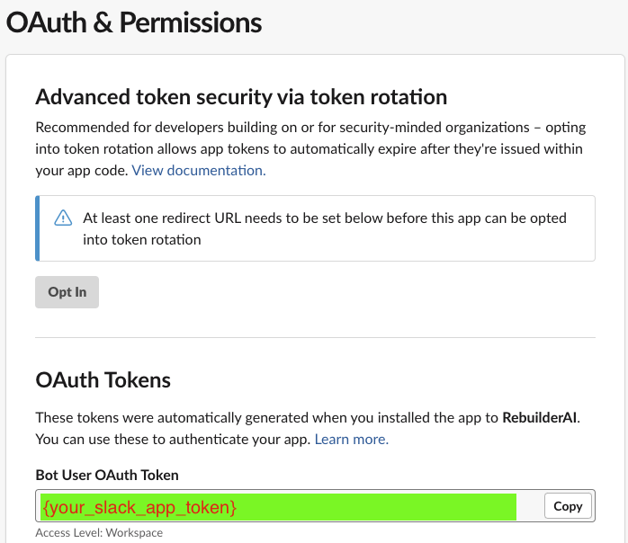
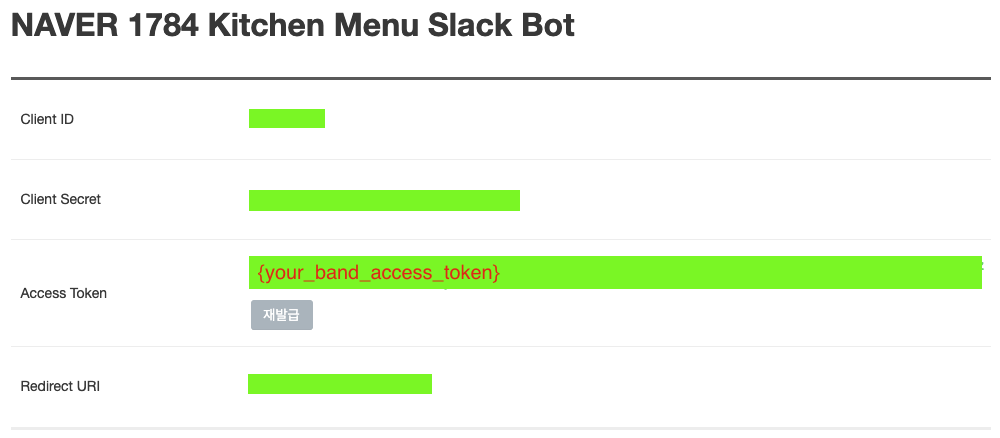

# NAVER 1784 Kitchen SLACK BOT

Using NAVER BAND API, get menu posts from NAVER BAND and send them to the Slack channel.

## Environment setup
```
pip install requirements.txt

# or
pip install slack_sdk python-dotenv
```

You should set your personal tokens in the `.env` file like below:
```
SLACK_TOKEN={your_slack_app_token}
BAND_ACCESS_TOKEN={your_band_access_token}
```



## Run
```
python bot.py
```